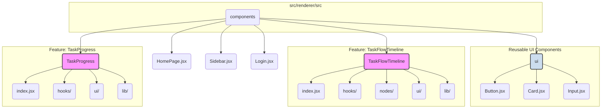

# Application Refactoring Guide

This document outlines the architectural best practices for structuring React components within this Electron and Vite application. The goal is to create a scalable, maintainable, and developer-friendly codebase.

## Core Principle: The Hybrid "Feature Folder" Approach

We will use a hybrid approach that combines two common strategies:

1.  **Feature Folders**: For large, complex components that represent a distinct "feature" of the application.
2.  **Flat Component Structure**: For smaller, reusable, or simple components.

This approach provides strong organization for complex features while maintaining simplicity for the rest of the application.

### When to Use a "Feature Folder"

A component should be given its own feature folder when it has several of the following characteristics:

*   It manages complex internal state.
*   It contains multiple custom hooks (`use...` functions).
*   It is composed of several child components that are not used anywhere else.
*   It has its own specific utility functions or constants.
*   It represents a major piece of functionality or a "page" in the application.

### Feature Folder Structure

When a component is identified as a feature, it should be organized with the following internal structure:

```
/src/renderer/src/components/
|-- MyFeature/
|   |-- index.jsx         # Main component file, assembles the feature
|   |-- hooks/            # Custom hooks specific to this feature
|   |-- ui/               # Sub-components used only by this feature
|   |-- lib/              # Utility functions, constants, etc.
|-- ui/
|   |-- Button.jsx
|   |-- Card.jsx
|-- SimpleComponent.jsx
```

### Current Application Architecture Plan

The following diagram illustrates how this hybrid approach will be applied to our application:



### Refactoring Plan

1.  **`TaskFlowTimeline` (Completed)**: This component has been refactored to follow the feature folder structure.

2.  **`TaskProgress` (Completed)**: This component has been refactored to follow the feature folder structure.

By following this guide, we will ensure that the application remains easy to understand, extend, and maintain as it grows in complexity.