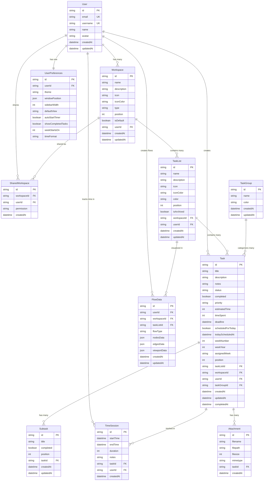

# Corrected Database Schema - Based on Actual Task Management Plan

## 🎯 **Corrected Application Flow**
```
User → Workspace (Sidebar: Default/Shared/Archive/Custom) 
     → TaskList (Home Page) 
     → TaskProgress Page (Kanban: backlog/thisweek/today/done)
     → Floating Today Window 
     → Focus Mode (1 task + timer)
```

## 📊 **Corrected Entity Relationship Diagram**



## 🔧 **Key Corrections Made:**

### **1. Removed Redundant Fields**
- ❌ Removed `kanbanColumn` - use existing `status` field
- ❌ Removed duplicate `workspaceId` references
- ✅ Keep all fields from your task management plan

### **2. Aligned with Your Actual Data Structure**
Based on your `taskData.js`, the Task entity should have:
```javascript
{
  id: number,
  title: string,
  timeSpent: number, // Accumulated from TimeSession
  estimatedTime: number,
  taskGroup: { name: string, color: string },
  priority: 'high' | 'medium' | 'low',
  status: 'backlog' | 'inprogress' | 'done', // Maps to kanban columns
  createdAt: ISO string,
  updatedAt: ISO string,
  completedAt: ISO string | null,
  deadline: ISO string,
  weekNumber: number,
  weekYear: number,
  assignedWeek: string, // "2025-W24"
  scheduledForToday: boolean,
  todayScheduledAt: ISO string | null,
  subtasks: array,
  notes: string,
  completed: boolean
}
```

### **3. TimeSession Purpose Explained**
```javascript
// When user clicks "activate" in floating window:
const session = {
  id: "session-1",
  taskId: "task-123",
  userId: "user-1", 
  startTime: "2025-06-18T13:30:00Z", // When activated
  endTime: null, // Still running
  duration: null, // Calculated when stopped
  notes: "Focused work session"
}

// When user stops timer:
session.endTime = "2025-06-18T15:30:00Z"
session.duration = 120 // 2 hours in minutes

// Update task.timeSpent += session.duration
```

### **4. Workspace Types**
```javascript
// Default workspaces (created automatically)
{ type: "default", name: "Personal", isDefault: true }
{ type: "shared", name: "Shared", isDefault: true }  
{ type: "archive", name: "Archive", isDefault: true }

// Custom workspaces (user created)
{ type: "custom", name: "Work Projects", isDefault: false }
{ type: "custom", name: "Side Projects", isDefault: false }
```

## 📋 **Simplified Prisma Schema**

```prisma
model User {
  id        String   @id @default(cuid())
  email     String?  @unique
  username  String   @unique
  name      String?
  avatar    String?
  createdAt DateTime @default(now())
  updatedAt DateTime @updatedAt
  
  workspaces    Workspace[]
  tasks         Task[]
  timeSessions  TimeSession[]
  preferences   UserPreferences?
  flowData      FlowData[]
  sharedWorkspaces SharedWorkspace[]
}

model Workspace {
  id          String   @id @default(cuid())
  name        String
  description String?
  icon        String   @default("W")
  iconColor   String   @default("bg-blue-500")
  type        String   @default("custom") // default/shared/archive/custom
  position    Int      @default(0)
  isDefault   Boolean  @default(false)
  userId      String
  createdAt   DateTime @default(now())
  updatedAt   DateTime @updatedAt
  
  user      User       @relation(fields: [userId], references: [id], onDelete: Cascade)
  taskLists TaskList[]
  tasks     Task[]
  flowData  FlowData[]
  sharedWith SharedWorkspace[]
}

model Task {
  id                String    @id @default(cuid())
  title             String
  description       String?
  notes             String?
  status            String    @default("backlog") // backlog/inprogress/done
  completed         Boolean   @default(false)
  priority          String    @default("medium") // low/medium/high
  estimatedTime     Int       @default(60) // minutes
  timeSpent         Int       @default(0)  // minutes (accumulated from TimeSession)
  deadline          DateTime?
  scheduledForToday Boolean   @default(false)
  todayScheduledAt  DateTime?
  weekNumber        Int?
  weekYear          Int?
  assignedWeek      String?   // "2025-W24"
  position          Int       @default(0)
  
  taskListId  String
  workspaceId String
  userId      String
  taskGroupId String?
  
  createdAt   DateTime  @default(now())
  updatedAt   DateTime  @updatedAt
  completedAt DateTime?
  
  taskList     TaskList      @relation(fields: [taskListId], references: [id], onDelete: Cascade)
  workspace    Workspace     @relation(fields: [workspaceId], references: [id], onDelete: Cascade)
  user         User          @relation(fields: [userId], references: [id], onDelete: Cascade)
  taskGroup    TaskGroup?    @relation(fields: [taskGroupId], references: [id])
  subtasks     Subtask[]
  timeSessions TimeSession[]
  attachments  Attachment[]
}

model TimeSession {
  id        String    @id @default(cuid())
  startTime DateTime  @default(now())
  endTime   DateTime?
  duration  Int?      // minutes (calculated when session ends)
  notes     String?
  
  taskId String
  userId String
  
  task User @relation(fields: [taskId], references: [id], onDelete: Cascade)
  user User @relation(fields: [userId], references: [id], onDelete: Cascade)
  
  createdAt DateTime @default(now())
}
```

## ✅ **This Design Now Matches Your Actual App:**

1. **Sidebar Workspaces**: Default (shared, archive) + custom workspaces
2. **Home Page**: TaskLists within selected workspace  
3. **TaskProgress**: Kanban with 4 columns using `status` field
4. **Floating Window**: Shows today's tasks with activate button
5. **Focus Mode**: Single task with timer (creates TimeSession)
6. **Timer Tracking**: TimeSession records work periods, accumulates to timeSpent

No unnecessary fields, aligned with your existing `taskData.js` structure!