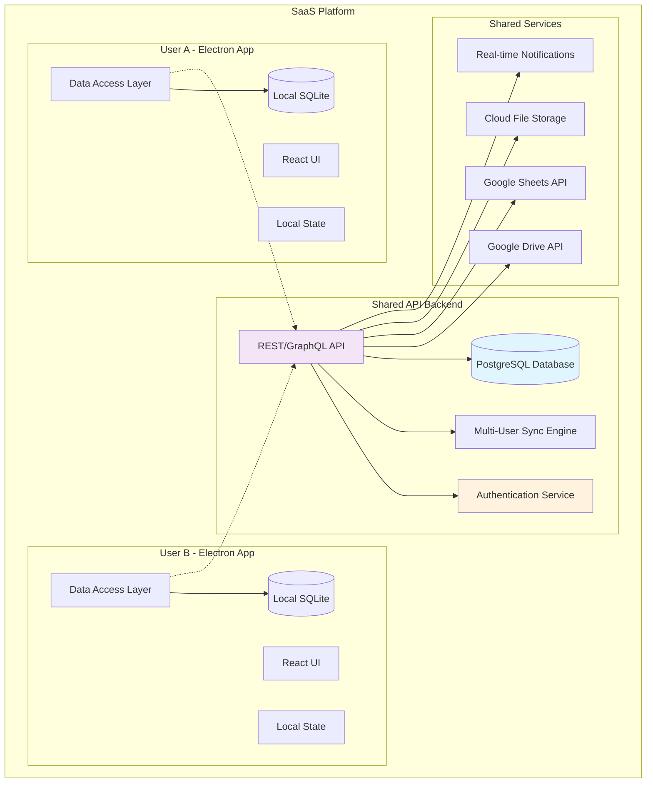

# Database Architecture Plan for Todo App (Multi-User SaaS)

## Executive Summary

Based on your requirements for handling hundreds/thousands of tasks, offline-first with future online API integration, backup/export capabilities, Google Drive/Spreadsheet integration, **multi-user SaaS functionality**, and **shared workspaces**, I recommend **SQLite with Prisma ORM** for development and **PostgreSQL with Prisma ORM** for production with a comprehensive multi-tenant architecture.

## Requirements Analysis

✅ **Scale**: Hundreds to thousands of tasks and workspaces per user
✅ **Offline-first**: Primary mode with local database
✅ **Future online**: Ready for API backend integration (PostgreSQL + Prisma)
✅ **Backup/Export**: Critical feature requirement
✅ **Cloud Integration**: Google Drive, Spreadsheets, file management
✅ **Robust**: Production-ready, reliable solution
✅ **ReactFlow Nodes**: Handle node positions and flow data
✅ **Multi-User SaaS**: Support multiple users and organizations
✅ **Shared Workspaces**: Collaborative workspaces and task lists
✅ **Permission System**: Role-based access control

## Recommended Architecture: Multi-Tenant SaaS Ready

### Core Database: SQLite (Dev) + PostgreSQL (Production) + Prisma ORM

**Why this combination is perfect for SaaS:**

1. **Multi-Tenancy**: Proper user isolation and shared workspace support
2. **Scalability**: PostgreSQL handles thousands of users efficiently
3. **Type Safety**: Prisma provides excellent TypeScript integration
4. **Migration System**: Easy schema evolution as SaaS features grow
5. **API Ready**: Built for REST/GraphQL APIs
6. **Backup Friendly**: Per-user and shared data backup strategies
7. **Future-Proof**: Enterprise-ready architecture
8. **ReactFlow Support**: Store node positions and flow configurations per user/workspace

### Multi-Tenant Architecture Diagram



## Enhanced Multi-User Database Schema

### User Management & Authentication

```sql
-- Users (Core user accounts)
CREATE TABLE users (
    id TEXT PRIMARY KEY,
    email TEXT UNIQUE NOT NULL,
    username TEXT UNIQUE,
    full_name TEXT NOT NULL,
    avatar_url TEXT,
    timezone TEXT DEFAULT 'UTC',
    language TEXT DEFAULT 'en',
    
    -- Authentication
    password_hash TEXT, -- For local auth
    email_verified BOOLEAN DEFAULT FALSE,
    email_verified_at DATETIME,
    
    -- OAuth providers
    google_id TEXT UNIQUE,
    github_id TEXT UNIQUE,
    
    -- Account status
    is_active BOOLEAN DEFAULT TRUE,
    is_premium BOOLEAN DEFAULT FALSE,
    subscription_tier TEXT DEFAULT 'free',
    
    -- Timestamps
    created_at DATETIME DEFAULT CURRENT_TIMESTAMP,
    updated_at DATETIME DEFAULT CURRENT_TIMESTAMP,
    last_login_at DATETIME,
    
    -- Sync
    synced_at DATETIME,
    server_id TEXT
);

-- Organizations (For team/company accounts)
CREATE TABLE organizations (
    id TEXT PRIMARY KEY,
    name TEXT NOT NULL,
    slug TEXT UNIQUE NOT NULL,
    description TEXT,
    avatar_url TEXT,
    
    -- Billing
    subscription_tier TEXT DEFAULT 'free',
    max_members INTEGER DEFAULT 5,
    
    -- Settings
    settings TEXT, -- JSON for org-specific settings
    
    created_at DATETIME DEFAULT CURRENT_TIMESTAMP,
    updated_at DATETIME DEFAULT CURRENT_TIMESTAMP,
    synced_at DATETIME,
    server_id TEXT
);

-- Organization Members (User-Organization relationships)
CREATE TABLE organization_members (
    id TEXT PRIMARY KEY,
    organization_id TEXT NOT NULL,
    user_id TEXT NOT NULL,
    role TEXT CHECK(role IN ('owner', 'admin', 'member', 'viewer')) DEFAULT 'member',
    
    -- Permissions
    can_create_workspaces BOOLEAN DEFAULT TRUE,
    can_manage_members BOOLEAN DEFAULT FALSE,
    can_manage_billing BOOLEAN DEFAULT FALSE,
    
    -- Status
    status TEXT CHECK(status IN ('active', 'invited', 'suspended')) DEFAULT 'active',
    invited_by TEXT,
    invited_at DATETIME,
    joined_at DATETIME,
    
    created_at DATETIME DEFAULT CURRENT_TIMESTAMP,
    updated_at DATETIME DEFAULT CURRENT_TIMESTAMP,
    synced_at DATETIME,
    server_id TEXT,
    
    FOREIGN KEY (organization_id) REFERENCES organizations(id) ON DELETE CASCADE,
    FOREIGN KEY (user_id) REFERENCES users(id) ON DELETE CASCADE,
    FOREIGN KEY (invited_by) REFERENCES users(id),
    UNIQUE(organization_id, user_id)
);
```

### Enhanced Workspace & Task Management

```sql
-- Workspaces (Enhanced for sharing)
CREATE TABLE workspaces (
    id TEXT PRIMARY KEY,
    name TEXT NOT NULL,
    description TEXT,
    color TEXT DEFAULT '#6366f1',
    icon TEXT DEFAULT 'folder',
    position INTEGER DEFAULT 0,
    
    -- Ownership & Sharing
    owner_id TEXT NOT NULL, -- User who created the workspace
    organization_id TEXT, -- NULL for personal workspaces
    visibility TEXT CHECK(visibility IN ('private', 'organization', 'public')) DEFAULT 'private',
    
    -- Sharing settings
    is_shared BOOLEAN DEFAULT FALSE,
    share_token TEXT UNIQUE, -- For public sharing
    allow_guest_access BOOLEAN DEFAULT FALSE,
    
    -- Status
    is_archived BOOLEAN DEFAULT FALSE,
    is_template BOOLEAN DEFAULT FALSE,
    
    created_at DATETIME DEFAULT CURRENT_TIMESTAMP,
    updated_at DATETIME DEFAULT CURRENT_TIMESTAMP,
    synced_at DATETIME,
    server_id TEXT,
    
    FOREIGN KEY (owner_id) REFERENCES users(id) ON DELETE CASCADE,
    FOREIGN KEY (organization_id) REFERENCES organizations(id) ON DELETE CASCADE
);

-- Workspace Members (User access to shared workspaces)
CREATE TABLE workspace_members (
    id TEXT PRIMARY KEY,
    workspace_id TEXT NOT NULL,
    user_id TEXT NOT NULL,
    role TEXT CHECK(role IN ('owner', 'admin', 'editor', 'viewer')) DEFAULT 'editor',
    
    -- Permissions
    can_edit_tasks BOOLEAN DEFAULT TRUE,
    can_delete_tasks BOOLEAN DEFAULT FALSE,
    can_manage_members BOOLEAN DEFAULT FALSE,
    can_export_data BOOLEAN DEFAULT TRUE,
    
    -- Status
    status TEXT CHECK(status IN ('active', 'invited', 'removed')) DEFAULT 'active',
    invited_by TEXT,
    invited_at DATETIME,
    joined_at DATETIME,
    
    created_at DATETIME DEFAULT CURRENT_TIMESTAMP,
    updated_at DATETIME DEFAULT CURRENT_TIMESTAMP,
    synced_at DATETIME,
    server_id TEXT,
    
    FOREIGN KEY (workspace_id) REFERENCES workspaces(id) ON DELETE CASCADE,
    FOREIGN KEY (user_id) REFERENCES users(id) ON DELETE CASCADE,
    FOREIGN KEY (invited_by) REFERENCES users(id),
    UNIQUE(workspace_id, user_id)
);

-- Task Lists (Enhanced for sharing)
CREATE TABLE task_lists (
    id TEXT PRIMARY KEY,
    workspace_id TEXT NOT NULL,
    name TEXT NOT NULL,
    description TEXT,
    icon TEXT DEFAULT 'list',
    color TEXT DEFAULT '#6366f1',
    position INTEGER DEFAULT 0,
    
    -- Ownership
    created_by TEXT NOT NULL,
    
    -- Sharing (inherits from workspace but can be overridden)
    visibility TEXT CHECK(visibility IN ('workspace', 'private', 'shared')) DEFAULT 'workspace',
    
    -- Status
    is_archived BOOLEAN DEFAULT FALSE,
    is_template BOOLEAN DEFAULT FALSE,
    
    created_at DATETIME DEFAULT CURRENT_TIMESTAMP,
    updated_at DATETIME DEFAULT CURRENT_TIMESTAMP,
    synced_at DATETIME,
    server_id TEXT,
    
    FOREIGN KEY (workspace_id) REFERENCES workspaces(id) ON DELETE CASCADE,
    FOREIGN KEY (created_by) REFERENCES users(id) ON DELETE CASCADE
);

-- Tasks (Enhanced with user tracking)
CREATE TABLE tasks (
    id TEXT PRIMARY KEY,
    task_list_id TEXT NOT NULL,
    title TEXT NOT NULL,
    description TEXT,
    status TEXT CHECK(status IN ('backlog', 'inprogress', 'done')) DEFAULT 'backlog',
    priority TEXT CHECK(priority IN ('low', 'medium', 'high')) DEFAULT 'medium',
    
    -- Ownership & Assignment
    created_by TEXT NOT NULL,
    assigned_to TEXT, -- Can be assigned to different user
    
    -- Time tracking
    estimated_time INTEGER DEFAULT 0, -- minutes
    time_spent INTEGER DEFAULT 0, -- minutes
    
    -- Week management
    week_number INTEGER,
    week_year INTEGER,
    assigned_week TEXT,
    scheduled_for_today BOOLEAN DEFAULT FALSE,
    today_scheduled_at DATETIME,
    
    -- Dates
    deadline DATETIME,
    created_at DATETIME DEFAULT CURRENT_TIMESTAMP,
    updated_at DATETIME DEFAULT CURRENT_TIMESTAMP,
    completed_at DATETIME,
    completed_by TEXT, -- Who completed the task
    
    -- Organization
    position INTEGER DEFAULT 0,
    task_group_name TEXT DEFAULT 'T',
    task_group_color TEXT DEFAULT '#6b7280',
    
    -- Collaboration
    last_modified_by TEXT,
    
    -- Sync
    synced_at DATETIME,
    server_id TEXT,
    
    FOREIGN KEY (task_list_id) REFERENCES task_lists(id) ON DELETE CASCADE,
    FOREIGN KEY (created_by) REFERENCES users(id) ON DELETE CASCADE,
    FOREIGN KEY (assigned_to) REFERENCES users(id) ON DELETE SET NULL,
    FOREIGN KEY (completed_by) REFERENCES users(id) ON DELETE SET NULL,
    FOREIGN KEY (last_modified_by) REFERENCES users(id) ON DELETE SET NULL
);

-- Task Collaborators (Multiple users can collaborate on a task)
CREATE TABLE task_collaborators (
    id TEXT PRIMARY KEY,
    task_id TEXT NOT NULL,
    user_id TEXT NOT NULL,
    role TEXT CHECK(role IN ('assignee', 'reviewer', 'watcher')) DEFAULT 'watcher',
    added_by TEXT NOT NULL,
    added_at DATETIME DEFAULT CURRENT_TIMESTAMP,
    
    FOREIGN KEY (task_id) REFERENCES tasks(id) ON DELETE CASCADE,
    FOREIGN KEY (user_id) REFERENCES users(id) ON DELETE CASCADE,
    FOREIGN KEY (added_by) REFERENCES users(id) ON DELETE CASCADE,
    UNIQUE(task_id, user_id)
);

-- Subtasks (Enhanced with user tracking)
CREATE TABLE subtasks (
    id TEXT PRIMARY KEY,
    task_id TEXT NOT NULL,
    title TEXT NOT NULL,
    completed BOOLEAN DEFAULT FALSE,
    position INTEGER DEFAULT 0,
    
    -- User tracking
    created_by TEXT NOT NULL,
    completed_by TEXT,
    completed_at DATETIME,
    
    created_at DATETIME DEFAULT CURRENT_TIMESTAMP,
    updated_at DATETIME DEFAULT CURRENT_TIMESTAMP,
    synced_at DATETIME,
    server_id TEXT,
    
    FOREIGN KEY (task_id) REFERENCES tasks(id) ON DELETE CASCADE,
    FOREIGN KEY (created_by) REFERENCES users(id) ON DELETE CASCADE,
    FOREIGN KEY (completed_by) REFERENCES users(id) ON DELETE SET NULL
);

-- Task Notes (Enhanced with user tracking)
CREATE TABLE task_notes (
    id TEXT PRIMARY KEY,
    task_id TEXT NOT NULL,
    content TEXT NOT NULL,
    
    -- User tracking
    created_by TEXT NOT NULL,
    updated_by TEXT,
    
    created_at DATETIME DEFAULT CURRENT_TIMESTAMP,
    updated_at DATETIME DEFAULT CURRENT_TIMESTAMP,
    synced_at DATETIME,
    server_id TEXT,
    
    FOREIGN KEY (task_id) REFERENCES tasks(id) ON DELETE CASCADE,
    FOREIGN KEY (created_by) REFERENCES users(id) ON DELETE CASCADE,
    FOREIGN KEY (updated_by) REFERENCES users(id) ON DELETE SET NULL
);

-- Attachments (Enhanced with user tracking)
CREATE TABLE attachments (
    id TEXT PRIMARY KEY,
    task_id TEXT NOT NULL,
    filename TEXT NOT NULL,
    original_name TEXT NOT NULL,
    file_path TEXT NOT NULL,
    file_type TEXT NOT NULL,
    file_size INTEGER NOT NULL,
    mime_type TEXT,
    
    -- User tracking
    uploaded_by TEXT NOT NULL,
    
    created_at DATETIME DEFAULT CURRENT_TIMESTAMP,
    updated_at DATETIME DEFAULT CURRENT_TIMESTAMP,
    synced_at DATETIME,
    server_id TEXT,
    cloud_url TEXT,
    
    FOREIGN KEY (task_id) REFERENCES tasks(id) ON DELETE CASCADE,
    FOREIGN KEY (uploaded_by) REFERENCES users(id) ON DELETE CASCADE
);

-- Time Entries (Enhanced with user tracking)
CREATE TABLE time_entries (
    id TEXT PRIMARY KEY,
    task_id TEXT NOT NULL,
    user_id TEXT NOT NULL, -- Who logged the time
    start_time DATETIME NOT NULL,
    end_time DATETIME,
    duration INTEGER, -- minutes
    description TEXT,
    
    created_at DATETIME DEFAULT CURRENT_TIMESTAMP,
    updated_at DATETIME DEFAULT CURRENT_TIMESTAMP,
    synced_at DATETIME,
    server_id TEXT,
    
    FOREIGN KEY (task_id) REFERENCES tasks(id) ON DELETE CASCADE,
    FOREIGN KEY (user_id) REFERENCES users(id) ON DELETE CASCADE
);
```

### Multi-User ReactFlow Timeline Support

```sql
-- ReactFlow Timeline Data (Enhanced for multi-user)
CREATE TABLE flow_timelines (
    id TEXT PRIMARY KEY,
    task_list_id TEXT NOT NULL,
    name TEXT NOT NULL DEFAULT 'Timeline',
    description TEXT,
    
    -- User tracking
    created_by TEXT NOT NULL,
    
    -- Sharing settings
    is_shared BOOLEAN DEFAULT FALSE,
    share_with_workspace BOOLEAN DEFAULT TRUE,
    
    created_at DATETIME DEFAULT CURRENT_TIMESTAMP,
    updated_at DATETIME DEFAULT CURRENT_TIMESTAMP,
    synced_at DATETIME,
    server_id TEXT,
    
    FOREIGN KEY (task_list_id) REFERENCES task_lists(id) ON DELETE CASCADE,
    FOREIGN KEY (created_by) REFERENCES users(id) ON DELETE CASCADE
);

-- ReactFlow Nodes (Enhanced for multi-user)
CREATE TABLE flow_nodes (
    id TEXT PRIMARY KEY,
    timeline_id TEXT NOT NULL,
    node_type TEXT CHECK(node_type IN ('task', 'attachment', 'subflow')) NOT NULL,
    
    -- Position data
    position_x REAL NOT NULL,
    position_y REAL NOT NULL,
    width REAL,
    height REAL,
    
    -- Node relationships
    parent_node_id TEXT,
    task_id TEXT,
    attachment_id TEXT,
    
    -- Node-specific data (JSON)
    node_data TEXT,
    
    -- Visual properties
    is_finished BOOLEAN DEFAULT FALSE,
    is_selected BOOLEAN DEFAULT FALSE,
    
    -- User tracking
    created_by TEXT NOT NULL,
    last_modified_by TEXT,
    
    created_at DATETIME DEFAULT CURRENT_TIMESTAMP,
    updated_at DATETIME DEFAULT CURRENT_TIMESTAMP,
    synced_at DATETIME,
    server_id TEXT,
    
    FOREIGN KEY (timeline_id) REFERENCES flow_timelines(id) ON DELETE CASCADE,
    FOREIGN KEY (parent_node_id) REFERENCES flow_nodes(id) ON DELETE CASCADE,
    FOREIGN KEY (task_id) REFERENCES tasks(id) ON DELETE CASCADE,
    FOREIGN KEY (attachment_id) REFERENCES attachments(id) ON DELETE CASCADE,
    FOREIGN KEY (created_by) REFERENCES users(id) ON DELETE CASCADE,
    FOREIGN KEY (last_modified_by) REFERENCES users(id) ON DELETE SET NULL
);

-- ReactFlow Edges (Enhanced for multi-user)
CREATE TABLE flow_edges (
    id TEXT PRIMARY KEY,
    timeline_id TEXT NOT NULL,
    source_node_id TEXT NOT NULL,
    target_node_id TEXT NOT NULL,
    
    -- Handle information
    source_handle TEXT,
    target_handle TEXT,
    
    -- Edge properties
    edge_type TEXT DEFAULT 'default',
    edge_style TEXT, -- JSON string for styling
    is_animated BOOLEAN DEFAULT FALSE,
    
    -- User tracking
    created_by TEXT NOT NULL,
    
    created_at DATETIME DEFAULT CURRENT_TIMESTAMP,
    updated_at DATETIME DEFAULT CURRENT_TIMESTAMP,
    synced_at DATETIME,
    server_id TEXT,
    
    FOREIGN KEY (timeline_id) REFERENCES flow_timelines(id) ON DELETE CASCADE,
    FOREIGN KEY (source_node_id) REFERENCES flow_nodes(id) ON DELETE CASCADE,
    FOREIGN KEY (target_node_id) REFERENCES flow_nodes(id) ON DELETE CASCADE,
    FOREIGN KEY (created_by) REFERENCES users(id) ON DELETE CASCADE
);
```

### Activity & Collaboration Features

```sql
-- Activity Log (Track all user actions)
CREATE TABLE activity_log (
    id TEXT PRIMARY KEY,
    user_id TEXT NOT NULL,
    workspace_id TEXT,
    task_list_id TEXT,
    task_id TEXT,
    
    -- Activity details
    action_type TEXT NOT NULL, -- 'created', 'updated', 'deleted', 'shared', 'completed', etc.
    entity_type TEXT NOT NULL, -- 'workspace', 'task_list', 'task', 'subtask', 'note', etc.
    entity_id TEXT NOT NULL,
    
    -- Change details
    old_values TEXT, -- JSON of previous values
    new_values TEXT, -- JSON of new values
    description TEXT, -- Human-readable description
    
    -- Metadata
    ip_address TEXT,
    user_agent TEXT,
    
    created_at DATETIME DEFAULT CURRENT_TIMESTAMP,
    synced_at DATETIME,
    server_id TEXT,
    
    FOREIGN KEY (user_id) REFERENCES users(id) ON DELETE CASCADE,
    FOREIGN KEY (workspace_id) REFERENCES workspaces(id) ON DELETE CASCADE,
    FOREIGN KEY (task_list_id) REFERENCES task_lists(id) ON DELETE CASCADE,
    FOREIGN KEY (task_id) REFERENCES tasks(id) ON DELETE CASCADE
);

-- Comments (Task discussions)
CREATE TABLE comments (
    id TEXT PRIMARY KEY,
    task_id TEXT NOT NULL,
    user_id TEXT NOT NULL,
    content TEXT NOT NULL,
    
    -- Threading
    parent_comment_id TEXT, -- For replies
    
    -- Status
    is_edited BOOLEAN DEFAULT FALSE,
    edited_at DATETIME,
    is_deleted BOOLEAN DEFAULT FALSE,
    deleted_at DATETIME,
    
    created_at DATETIME DEFAULT CURRENT_TIMESTAMP,
    updated_at DATETIME DEFAULT CURRENT_TIMESTAMP,
    synced_at DATETIME,
    server_id TEXT,
    
    FOREIGN KEY (task_id) REFERENCES tasks(id) ON DELETE CASCADE,
    FOREIGN KEY (user_id) REFERENCES users(id) ON DELETE CASCADE,
    FOREIGN KEY (parent_comment_id) REFERENCES comments(id) ON DELETE CASCADE
);

-- Notifications (Real-time updates)
CREATE TABLE notifications (
    id TEXT PRIMARY KEY,
    user_id TEXT NOT NULL,
    type TEXT NOT NULL, -- 'task_assigned', 'task_completed', 'comment_added', 'workspace_shared', etc.
    title TEXT NOT NULL,
    message TEXT NOT NULL,
    
    -- Related entities
    workspace_id TEXT,
    task_list_id TEXT,
    task_id TEXT,
    comment_id TEXT,
    triggered_by TEXT, -- User who triggered the notification
    
    -- Status
    is_read BOOLEAN DEFAULT FALSE,
    read_at DATETIME,
    
    -- Delivery
    sent_email BOOLEAN DEFAULT FALSE,
    sent_push BOOLEAN DEFAULT FALSE,
    
    created_at DATETIME DEFAULT CURRENT_TIMESTAMP,
    synced_at DATETIME,
    server_id TEXT,
    
    FOREIGN KEY (user_id) REFERENCES users(id) ON DELETE CASCADE,
    FOREIGN KEY (workspace_id) REFERENCES workspaces(id) ON DELETE CASCADE,
    FOREIGN KEY (task_list_id) REFERENCES task_lists(id) ON DELETE CASCADE,
    FOREIGN KEY (task_id) REFERENCES tasks(id) ON DELETE CASCADE,
    FOREIGN KEY (comment_id) REFERENCES comments(id) ON DELETE CASCADE,
    FOREIGN KEY (triggered_by) REFERENCES users(id) ON DELETE SET NULL
);

-- Sync Log (Enhanced for multi-user)
CREATE TABLE sync_log (
    id TEXT PRIMARY KEY,
    user_id TEXT NOT NULL,
    table_name TEXT NOT NULL,
    record_id TEXT NOT NULL,
    action TEXT CHECK(action IN ('create', 'update', 'delete')) NOT NULL,
    sync_status TEXT CHECK(sync_status IN ('pending', 'synced', 'failed', 'conflict')) DEFAULT 'pending',
    error_message TEXT,
    conflict_resolution TEXT, -- How conflicts were resolved
    
    created_at DATETIME DEFAULT CURRENT_TIMESTAMP,
    synced_at DATETIME,
    
    FOREIGN KEY (user_id) REFERENCES users(id) ON DELETE CASCADE
);
```

## Multi-User Data Access Layer

### Enhanced Service Layer for SaaS

```typescript
interface MultiUserDatabaseService {
  // User Management
  auth: {
    createUser(data: CreateUserData): Promise<User>
    getUserById(id: string): Promise<User | null>
    getUserByEmail(email: string): Promise<User | null>
    updateUser(id: string, data: UpdateUserData): Promise<User>
    deleteUser(id: string): Promise<void>
  }
  
  // Organization Management
  organizations: {
    createOrganization(data: CreateOrgData): Promise<Organization>
    getUserOrganizations(userId: string): Promise<Organization[]>
    addMember(orgId: string, userId: string, role: string): Promise<void>
    removeMember(orgId: string, userId: string): Promise<void>
    updateMemberRole(orgId: string, userId: string, role: string): Promise<void>
  }
  
  // Workspace Management (Enhanced for sharing)
  workspaces: {
    createWorkspace(data: CreateWorkspaceData, userId: string): Promise<Workspace>
    getUserWorkspaces(userId: string): Promise<Workspace[]>
    getSharedWorkspaces(userId: string): Promise<Workspace[]>
    shareWorkspace(workspaceId: string, userIds: string[], role: string): Promise<void>
    unshareWorkspace(workspaceId: string, userId: string): Promise<void>
    updateWorkspacePermissions(workspaceId: string, userId: string, permissions: Permissions): Promise<void>
  }
  
  // Task Management (Enhanced for collaboration)
  tasks: {
    createTask(data: CreateTaskData, userId: string): Promise<Task>
    getTasksForUser(userId: string, filters: TaskFilters): Promise<Task[]>
    getSharedTasks(userId: string, filters: TaskFilters): Promise<Task[]>
    assignTask(taskId: string, assigneeId: string, assignedBy: string): Promise<void>
    addCollaborator(taskId: string, userId: string, role: string): Promise<void>
    removeCollaborator(taskId: string, userId: string): Promise<void>
    updateTask(taskId: string, data: UpdateTaskData, userId: string): Promise<Task>
    completeTask(taskId: string, userId: string): Promise<void>
  }
  
  // ReactFlow Timeline (Enhanced for multi-user)
  timelines: {
    createTimeline(taskListId: string, userId: string, data: CreateTimelineData): Promise<FlowTimeline>
    getTimeline(taskListId: string, userId: string): Promise<FlowTimeline | null>
    shareTimeline(timelineId: string, userIds: string[]): Promise<void>
    saveNode(timelineId: string, node: FlowNode, userId: string): Promise<void>
    saveEdge(timelineId: string, edge: FlowEdge, userId: string): Promise<void>
    getCollaborativeFlowState(timelineId: string, userId: string): Promise<{ nodes: FlowNode[], edges: FlowEdge[] }>
  }
  
  // Activity & Collaboration
  activity: {
    logActivity(userId: string, action: ActivityData): Promise<void>
    getUserActivity(userId: string, filters: ActivityFilters): Promise<Activity[]>
    getWorkspaceActivity(workspaceId: string, userId: string): Promise<Activity[]>
  }
  
  comments: {
    addComment(taskId: string, userId: string, content: string, parentId?: string): Promise<Comment>
    getTaskComments(taskId: string, userId: string): Promise<Comment[]>
    updateComment(commentId: string, userId: string, content: string): Promise<Comment>
    deleteComment(commentId: string, userId: string): Promise<void>
  }
  
  notifications: {
    createNotification(data: CreateNotificationData): Promise<void>
    getUserNotifications(userId: string, unreadOnly?: boolean): Promise<Notification[]>
    markAsRead(notificationId: string, userId: string): Promise<void>
    markAllAsRead(userId: string): Promise<void>
  }
  
  // Permission System
  permissions: {
    canUserAccessWorkspace(userId: string, workspaceId: string): Promise<boolean>
    canUserEditTask(userId: string, taskId: string): Promise<boolean>
    canUserManageWorkspace(userId: string, workspaceId: string): Promise<boolean>
    getUserRole(userId: string, workspaceId: string): Promise<string | null>
  }
}
```

## Multi-User Sync Strategy

### 1. Conflict Resolution
```typescript
interface ConflictResolution {
  strategy: 'last_write_wins' | 'merge' | 'user_choice'
  resolvedBy: string
  conflictData: {
    local: any
    remote: any
    resolved: any
  }
}
```

### 2. Real-time Collaboration
- **WebSocket connections** for live updates
- **Operational Transform** for concurrent editing
- **Presence indicators** showing who's online
- **Live cursors** in ReactFlow timelines

### 3. Offline-First with Multi-User Sync
- **Local SQLite** stores user's data + cached shared data
- **Sync queue** for offline changes
- **Conflict detection** on reconnection
- **Merge strategies** for collaborative edits

## Permission System

### Role-Based Access Control (RBAC)

```typescript
interface Permissions {
  workspace: {
    view: boolean
    edit: boolean
    delete: boolean
    share: boolean
    manage_members: boolean
  }
  
  tasks: {
    view: boolean
    create: boolean
    edit: boolean
    delete: boolean
    assign: boolean
    complete: boolean
  }
  
  timelines: {
    view: boolean
    edit: boolean
    create_nodes: boolean
    delete_nodes: boolean
    share: boolean
  }
}

// Role definitions
const ROLES = {
  owner: { /* full permissions */ },
  admin: { /* most permissions */ },
  editor: { /* edit permissions */ },
  viewer: { /* read-only permissions */ }
}
```

## SaaS-Specific Features

### 1. Subscription Management
- **Free tier**: 3 workspaces, 50 tasks per workspace
- **Pro tier**: Unlimited workspaces, advanced features
- **Team tier**: Organization features, advanced collaboration
- **Enterprise tier**: SSO, advanced security, custom integrations

### 2. Usage Analytics
- **Task completion rates** per user/workspace
- **Collaboration metrics** (comments, shares, etc.)
- **Feature usage** tracking
- **Performance metrics** for optimization

### 3. Data Export/Import
- **Per-user exports** with privacy controls
- **Shared workspace exports** with permission checks
- **GDPR compliance** for data deletion
- **Backup strategies** for shared data

## Implementation Phases for SaaS

### Phase 1: Multi-User Foundation (Week 1-3)
1. **User authentication system**
2. **Basic workspace sharing**
3. **Permission framework**
4. **Multi-tenant data isolation**

### Phase 2: Collaboration Features (Week 3-5)
1. **Real-time sync engine**
2. **Activity logging**
3. **Comment system**
4. **Notification system**

### Phase 3: Advanced SaaS Features (Week 5-7)
1. **Organization management**
2. **Advanced permissions**
3. **Usage analytics**
4. **Subscription management**

### Phase 4: Enterprise Features (Week 7-9)
1. **SSO integration**
2. **Advanced security**
3. **Audit logs**
4. **Custom integrations**

## Benefits of Multi-User SaaS Architecture

### Immediate Benefits
✅ **Scalability**: Handle thousands of users and shared workspaces
✅ **Collaboration**: Real-time multi-user editing and sharing
✅ **Security**: Proper permission system and data isolation
✅ **Flexibility**: Support both personal and team workflows

### SaaS Benefits
✅ **Revenue Model**: Subscription-based with tiered features
✅ **User Retention**: Collaboration features increase stickiness
✅ **Viral Growth**: Workspace sharing drives user acquisition
✅ **Enterprise Ready**: Organization features for B2B sales

### Technical Benefits
✅ **Future-Proof**: Built for scale from day one
✅ **API-First**: Ready for mobile apps and integrations
✅ **Real-time**: Live collaboration and updates
✅ **Offline-First**: Works without internet, syncs when online

This enhanced multi-user SaaS architecture provides a solid foundation for building a collaborative task management platform that can scale from individual users to large organizations while maintaining the offline-first approach you need for the Electron app.