# TaskLeap Database Schema - Mermaid Diagram

```mermaid
erDiagram
    User {
        string id PK "cuid()"
        string email UK "nullable"
        string username UK
        string password
        string name "nullable"
        string avatar "nullable"
        datetime createdAt "default(now())"
        datetime updatedAt "updatedAt"
    }
    
    Workspace {
        int id PK "autoincrement()"
        string name
        datetime createdAt "default(now())"
        datetime updatedAt "updatedAt"
        string userId FK
    }
    
    List {
        int id PK "autoincrement()"
        string name
        string icon
        string iconColor
        datetime createdAt "default(now())"
        datetime updatedAt "updatedAt"
        int workspaceId FK
    }
    
    Task {
        int id PK "autoincrement()"
        string title
        string status "default('inprogress')"
        string priority "default('medium')"
        string notes "nullable"
        int timeSpent "default(0)"
        int estimatedTime "default(60)"
        int orderInColumn "default(0)"
        int weekNumber "nullable"
        int weekYear "nullable"
        datetime createdAt "default(now())"
        datetime updatedAt "updatedAt"
        datetime completedAt "nullable"
        datetime deadline "nullable"
        string assignedWeek "nullable"
        boolean scheduledForToday "default(false)"
        datetime todayScheduledAt "nullable"
        int listId FK
    }
    
    Subtask {
        int id PK "autoincrement()"
        string title
        boolean completed "default(false)"
        int order "default(0)"
        int taskId FK
    }

    %% Relationships
    User ||--o{ Workspace : "has many"
    Workspace ||--o{ List : "contains"
    List ||--o{ Task : "contains"
    Task ||--o{ Subtask : "has many"
    
    %% Relationship Details
    User ||--|| Workspace : "userId"
    Workspace ||--|| List : "workspaceId"
    List ||--|| Task : "listId"
    Task ||--|| Subtask : "taskId (CASCADE DELETE)"
```

## Database Relationships Explanation

### 1. User → Workspace (One-to-Many)
- Each user can have multiple workspaces
- Workspaces are deleted when user is deleted (CASCADE)
- Foreign key: `Workspace.userId` → `User.id`

### 2. Workspace → List (One-to-Many)
- Each workspace can contain multiple lists
- Lists belong to exactly one workspace
- Foreign key: `List.workspaceId` → `Workspace.id`

### 3. List → Task (One-to-Many)
- Each list can contain multiple tasks
- Tasks belong to exactly one list
- Foreign key: `Task.listId` → `List.id`

### 4. Task → Subtask (One-to-Many)
- Each task can have multiple subtasks
- Subtasks are deleted when parent task is deleted (CASCADE)
- Foreign key: `Subtask.taskId` → `Task.id`

## Key Features

### User Management
- Unique email and username constraints
- Optional profile information (name, avatar)
- Automatic timestamp tracking

### Task Organization
- Hierarchical structure: User → Workspace → List → Task → Subtask
- Flexible task properties (status, priority, time tracking)
- Week-based organization with scheduling capabilities

### Time Tracking
- `timeSpent`: Actual time spent on task
- `estimatedTime`: Planned time for task completion
- `scheduledForToday`: Boolean flag for daily planning
- `todayScheduledAt`: Timestamp when scheduled for today

### Task Management
- `orderInColumn`: For drag-and-drop reordering
- `weekNumber` & `weekYear`: Week-based organization
- `completedAt`: Completion timestamp
- `deadline`: Due date tracking