# Database Schema Diagram

## Entity Relationship Diagram

```mermaid
erDiagram
    User {
        string id PK
        string email UK
        string username UK
        string name
        string avatar
        datetime createdAt
        datetime updatedAt
    }
    
    UserPreferences {
        string id PK
        string userId FK
        string theme
        json windowPosition
        int sidebarWidth
        string defaultView
        boolean autoStartTimer
        boolean showCompletedTasks
        int weekStartsOn
        string timeFormat
    }
    
    TaskList {
        string id PK
        string name
        string description
        string icon
        string iconColor
        string color
        int position
        boolean isArchived
        string userId FK
        datetime createdAt
        datetime updatedAt
    }
    
    TaskGroup {
        string id PK
        string name
        string color
        datetime createdAt
        datetime updatedAt
    }
    
    Task {
        string id PK
        string title
        string description
        string notes
        string status
        boolean completed
        string priority
        int estimatedTime
        int timeSpent
        datetime deadline
        boolean scheduledForToday
        datetime todayScheduledAt
        int weekNumber
        int weekYear
        string assignedWeek
        int position
        string taskListId FK
        string userId FK
        string taskGroupId FK
        datetime createdAt
        datetime updatedAt
        datetime completedAt
    }
    
    Subtask {
        string id PK
        string title
        boolean completed
        int position
        string taskId FK
        datetime createdAt
        datetime updatedAt
    }
    
    TimeSession {
        string id PK
        datetime startTime
        datetime endTime
        int duration
        string notes
        string taskId FK
        string userId FK
        datetime createdAt
    }
    
    FlowData {
        string id PK
        string userId FK
        string taskListId FK
        string flowType
        json nodesData
        json edgesData
        json viewportData
        datetime createdAt
        datetime updatedAt
    }
    
    Attachment {
        string id PK
        string filename
        string filepath
        int filesize
        string mimetype
        string taskId FK
        datetime createdAt
    }
    
    SharedTaskList {
        string id PK
        string taskListId FK
        string userId FK
        string permission
        datetime createdAt
    }

    %% Relationships
    User ||--o{ UserPreferences : has
    User ||--o{ TaskList : owns
    User ||--o{ Task : creates
    User ||--o{ TimeSession : tracks
    User ||--o{ FlowData : creates
    User ||--o{ SharedTaskList : shares
    
    TaskList ||--o{ Task : contains
    TaskList ||--o{ FlowData : visualizes
    TaskList ||--o{ SharedTaskList : shared_as
    
    TaskGroup ||--o{ Task : categorizes
    
    Task ||--o{ Subtask : has
    Task ||--o{ TimeSession : tracked_in
    Task ||--o{ Attachment : has
    
    %% Constraints and Notes
    User {
        note "Primary user entity for multi-user support"
    }
    
    Task {
        note "Core task entity with week-based management"
    }
    
    FlowData {
        note "React Flow data stored as JSON for simplicity"
    }
    
    TimeSession {
        note "Time tracking sessions for productivity analytics"
    }
```

## Clear Entity Relationship Diagram (ERD)

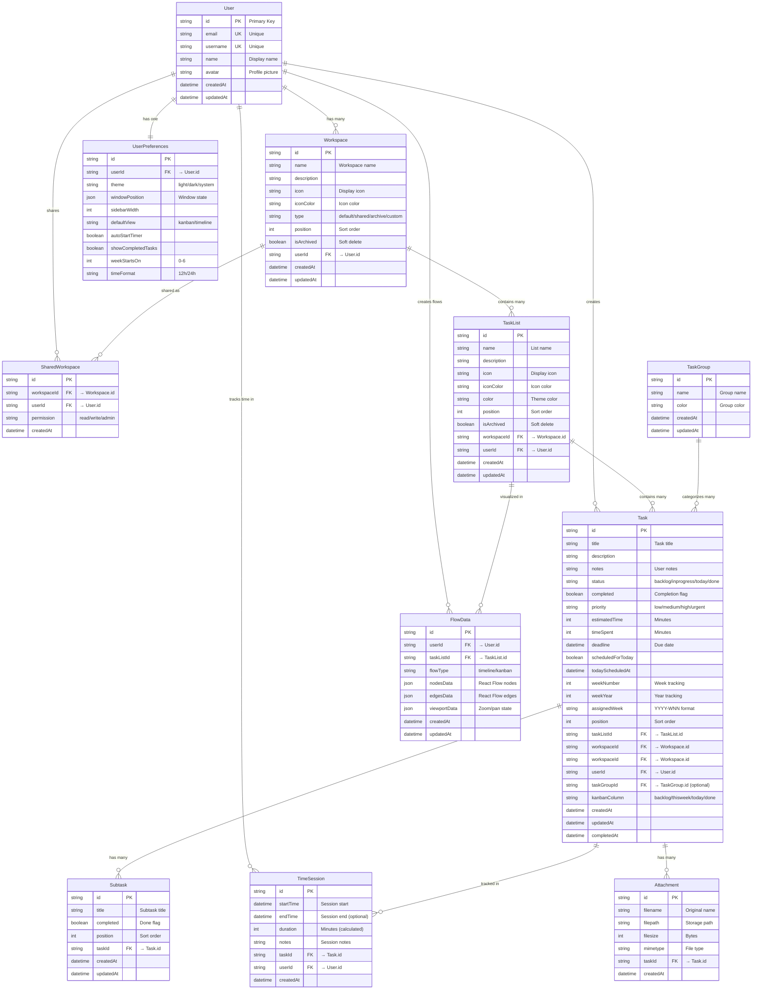

## Hierarchical Relationship Structure

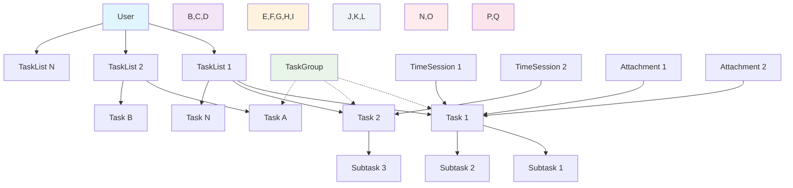

## Database Design Principles

### 1. **Offline-First Architecture**
- SQLite for local storage
- All operations work without internet
- Easy migration to cloud databases

### 2. **JSON Storage Strategy**
- **FlowData**: React Flow nodes/edges stored as JSON
- **UserPreferences**: Window positions and UI state as JSON
- **Benefits**: Simple, flexible, no complex joins needed

### 3. **Future-Proof Design**
- User management ready for multi-user
- Sharing mechanisms prepared
- Cloud sync architecture considered

### 4. **Performance Optimizations**
- Indexed foreign keys
- Efficient queries for common operations
- Minimal data duplication

## Key Design Decisions

### React Flow Data Storage
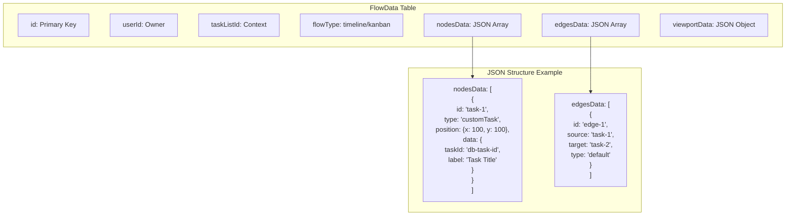

### Time Tracking Architecture
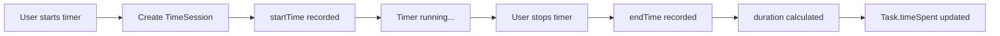

### Task Status Flow
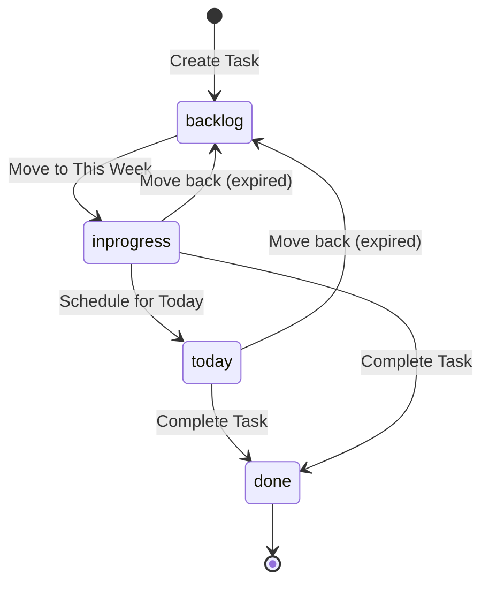

## Migration Strategy

### Phase 1: Core Tables
1. User & UserPreferences
2. TaskList & TaskGroup
3. Task & Subtask

### Phase 2: Advanced Features
1. TimeSession
2. FlowData
3. Attachment

### Phase 3: Collaboration
1. SharedTaskList
2. Additional user management

## Indexing Strategy

```sql
-- Performance indexes
CREATE INDEX idx_task_user_status ON Task(userId, status);
CREATE INDEX idx_task_list_position ON Task(taskListId, position);
CREATE INDEX idx_task_assigned_week ON Task(assignedWeek);
CREATE INDEX idx_time_session_task ON TimeSession(taskId);
CREATE INDEX idx_flow_data_user_list ON FlowData(userId, taskListId);
```

## Detailed Relationship Diagram

```mermaid
graph TB
    subgraph "User Management"
        U[User]
        UP[UserPreferences]
        U ||--|| UP
    end
    
    subgraph "Task Organization"
        TL[TaskList]
        TG[TaskGroup]
        T[Task]
        ST[Subtask]
        
        TL ||--o{ T
        TG ||--o{ T
        T ||--o{ ST
    end
    
    subgraph "Time & Flow Data"
        TS[TimeSession]
        FD[FlowData]
        
        T ||--o{ TS
        TL ||--o{ FD
    end
    
    subgraph "Files & Sharing"
        A[Attachment]
        STL[SharedTaskList]
        
        T ||--o{ A
        TL ||--o{ STL
    end
    
    %% User relationships
    U ||--o{ TL
    U ||--o{ T
    U ||--o{ TS
    U ||--o{ FD
    U ||--o{ STL
    
    %% Styling
    classDef userClass fill:#e1f5fe
    classDef taskClass fill:#f3e5f5
    classDef dataClass fill:#e8f5e8
    classDef fileClass fill:#fff3e0
    
    class U,UP userClass
    class TL,TG,T,ST taskClass
    class TS,FD dataClass
    class A,STL fileClass
```

## Relationship Types and Cardinalities

### One-to-One Relationships
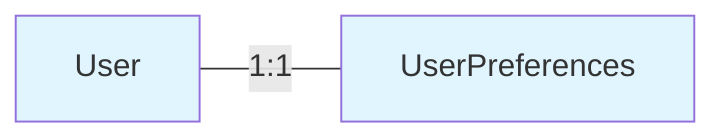

### One-to-Many Relationships
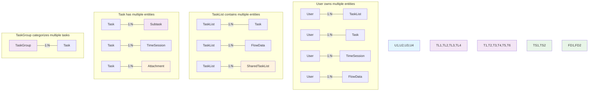

## Foreign Key Relationships

### Primary Foreign Keys
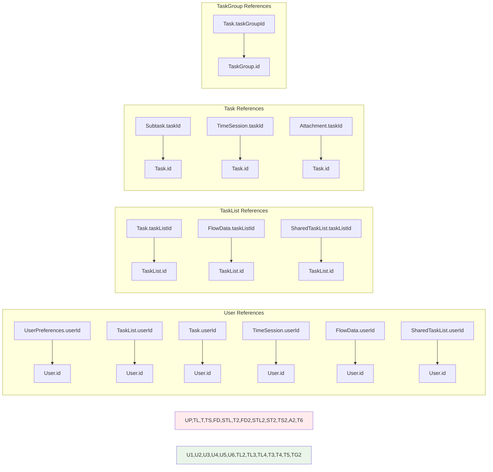

## Data Flow Relationships

### Task Lifecycle Flow
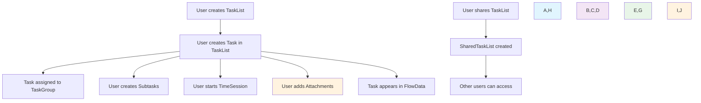

### React Flow Data Relationship
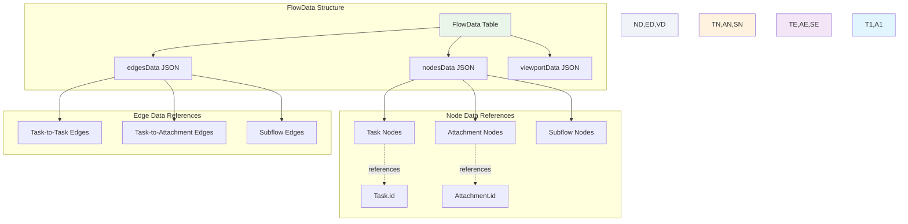

## Cascade and Constraint Rules

### Deletion Cascades
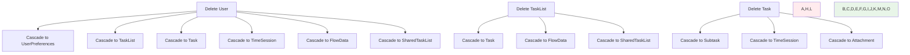

### Optional Relationships
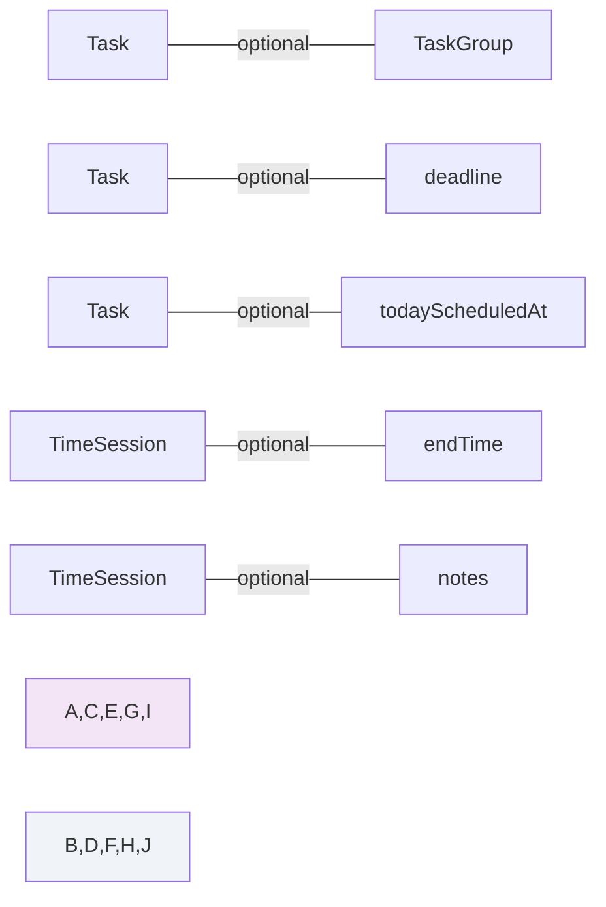

## Data Integrity Rules

1. **Cascading Deletes**: User deletion removes all related data
2. **Soft Deletes**: TaskList archiving instead of deletion
3. **Referential Integrity**: Foreign key constraints enforced
4. **Data Validation**: Prisma schema validation for all fields
5. **Unique Constraints**: User email/username uniqueness
6. **Optional References**: TaskGroup and deadline are optional for tasks