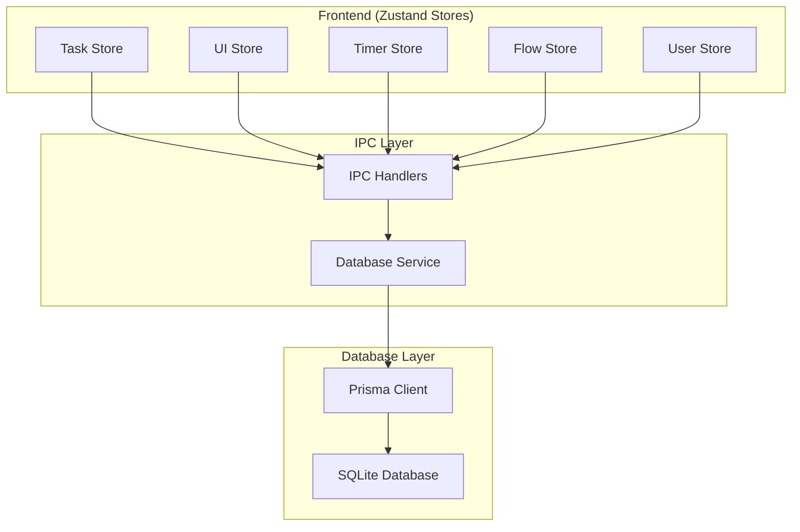
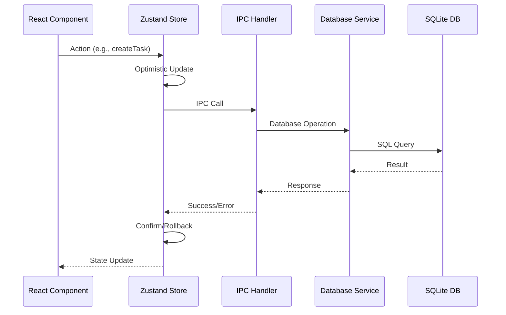

# Database & Tech Stack Design Plan for To-Do Application

## Executive Summary

This document outlines a comprehensive database and tech stack design for your Electron-based task management application. The plan focuses on creating a simple but robust offline-first solution that can easily scale to support online features, multi-user functionality, and sharing capabilities in the future.

## Current Application Analysis

### Existing Architecture
- **Framework**: Electron with React 18
- **UI**: Tailwind CSS + Radix UI + shadcn/ui components
- **Animations**: Framer Motion
- **Flow Visualization**: React Flow (for task timeline/flowchart)
- **Current State**: In-memory JavaScript objects in `taskData.js`
- **Features**: 
  - Kanban boards with drag & drop
  - Time tracking with timer functionality
  - Multiple window modes (normal, floating, focus)
  - Complex task flow timeline with React Flow
  - Task groups, subtasks, attachments
  - Week-based task management

### React Flow Usage Analysis
Your React Flow implementation is sophisticated, handling:
- **Task Nodes**: Custom task cards with handles for connections
- **Attachment Nodes**: File attachments that can connect to tasks
- **Subflow Nodes**: Grouped attachment containers
- **Dynamic Connections**: Task-to-task flow, task-to-attachment relationships
- **Drag & Drop**: From sidebar to canvas with auto-positioning
- **Context Menus**: Right-click actions for nodes
- **Real-time Updates**: Node highlighting, edge animations

## Recommended Tech Stack

### Frontend Layer
```
React 18
├── State Management: Zustand (replacing in-memory state)
├── UI Components: Radix UI + shadcn/ui
├── Styling: Tailwind CSS
├── Animations: Framer Motion
├── Flow Visualization: React Flow
├── Icons: Lucide React
└── Drag & Drop: @dnd-kit
```

### Desktop Application Layer
```
Electron
├── Build Tool: Electron Vite
├── Process Communication: IPC
├── Window Management: Custom controls
└── File System: Node.js APIs
```

### Database & Persistence Layer
```
Database Stack
├── ORM: Prisma
├── Local Database: SQLite (offline-first)
├── Future Cloud: PostgreSQL/MySQL
└── Migration Tool: Prisma Migrate
```

### State Management Architecture



## Database Schema Design

### Core Entities

#### 1. User Management (Future-Ready)
```sql
User
├── id (String, Primary Key)
├── email (String, Unique)
├── username (String, Unique)
├── name (String)
├── avatar (String)
├── createdAt (DateTime)
└── updatedAt (DateTime)

UserPreferences
├── id (String, Primary Key)
├── userId (String, Foreign Key)
├── theme (String: light/dark/system)
├── windowPosition (JSON)
├── sidebarWidth (Int)
├── defaultView (String: kanban/timeline)
├── autoStartTimer (Boolean)
├── showCompletedTasks (Boolean)
├── weekStartsOn (Int: 0-6)
└── timeFormat (String: 12h/24h)
```

#### 2. Workspace & Task Management
```sql
Workspace
├── id (String, Primary Key)
├── name (String)
├── description (String)
├── icon (String)
├── iconColor (String)
├── type (String: default/shared/archive/custom)
├── position (Int)
├── isArchived (Boolean)
├── userId (String, Foreign Key)
├── createdAt (DateTime)
└── updatedAt (DateTime)

TaskList
├── id (String, Primary Key)
├── name (String)
├── description (String)
├── icon (String)
├── iconColor (String)
├── position (Int)
├── isArchived (Boolean)
├── workspaceId (String, Foreign Key)
├── userId (String, Foreign Key)
├── createdAt (DateTime)
└── updatedAt (DateTime)

TaskGroup
├── id (String, Primary Key)
├── name (String)
├── color (String)
├── createdAt (DateTime)
└── updatedAt (DateTime)

Task
├── id (String, Primary Key)
├── title (String)
├── description (String)
├── notes (String)
├── status (String: backlog/thisweek/today/done)
├── completed (Boolean)
├── priority (String: low/medium/high/urgent)
├── estimatedTime (Int, minutes)
├── timeSpent (Int, minutes)
├── deadline (DateTime)
├── scheduledForToday (Boolean)
├── todayScheduledAt (DateTime)
├── weekNumber (Int)
├── weekYear (Int)
├── assignedWeek (String)
├── kanbanColumn (String: backlog/thisweek/today/done)
├── position (Int)
├── taskListId (String, Foreign Key)
├── workspaceId (String, Foreign Key)
├── userId (String, Foreign Key)
├── taskGroupId (String, Foreign Key)
├── createdAt (DateTime)
├── updatedAt (DateTime)
└── completedAt (DateTime)

Subtask
├── id (String, Primary Key)
├── title (String)
├── completed (Boolean)
├── position (Int)
├── taskId (String, Foreign Key)
├── createdAt (DateTime)
└── updatedAt (DateTime)
```

#### 3. Time Tracking
```sql
TimeSession
├── id (String, Primary Key)
├── startTime (DateTime)
├── endTime (DateTime)
├── duration (Int, minutes)
├── notes (String)
├── taskId (String, Foreign Key)
├── userId (String, Foreign Key)
└── createdAt (DateTime)
```

#### 4. React Flow Data (Simple Approach)
```sql
FlowData
├── id (String, Primary Key)
├── userId (String, Foreign Key)
├── workspaceId (String, Foreign Key)
├── taskListId (String, Foreign Key)
├── flowType (String: timeline/kanban)
├── nodesData (JSON)
├── edgesData (JSON)
├── viewportData (JSON)
├── createdAt (DateTime)
└── updatedAt (DateTime)
```

#### 5. Attachments & File Management
```sql
Attachment
├── id (String, Primary Key)
├── filename (String)
├── filepath (String)
├── filesize (Int)
├── mimetype (String)
├── taskId (String, Foreign Key)
└── createdAt (DateTime)
```

#### 6. Sharing & Collaboration (Future)
```sql
SharedWorkspace
├── id (String, Primary Key)
├── workspaceId (String, Foreign Key)
├── userId (String, Foreign Key)
├── permission (String: read/write/admin)
└── createdAt (DateTime)
```

## React Flow Database Strategy

### Simple but Robust Approach

Instead of creating complex relational tables for React Flow nodes and edges, we'll use a **JSON-based approach** that's simple to implement and maintain:

#### 1. Application Flow Structure
```
User → Workspace (Sidebar) → TaskList (Home Page) → TaskProgress Page
                                                   ├── Kanban View (4 columns)
                                                   ├── Flowchart View
                                                   ├── Floating Today Window
                                                   └── Focus Mode (1 task)
```

#### 2. Kanban Columns (Fixed)
- **Backlog**: User can create tasks
- **This Week**: User can create tasks
- **Today**: User can create tasks
- **Done**: Tasks move here when completed (read-only for creation)

#### 3. Flow Data Storage
```javascript
// Store complete flow state as JSON
const flowData = {
  nodes: [
    {
      id: "task-1",
      type: "customTask",
      position: { x: 100, y: 100 },
      data: {
        taskId: "actual-task-id-from-db",
        label: "Task Title",
        kanbanColumn: "today",
        // ... other task data
      }
    }
  ],
  edges: [
    {
      id: "edge-1",
      source: "task-1",
      target: "task-2",
      // ... edge properties
    }
  ],
  viewport: { x: 0, y: 0, zoom: 1 }
}
```

#### 2. Benefits of JSON Approach
- **Simple**: No complex relational mapping
- **Flexible**: Easy to add new node/edge types
- **Fast**: Single query to load entire flow
- **Robust**: React Flow natively works with this format
- **Future-proof**: Easy to extend without schema changes

#### 4. Flow Data Management
```javascript
// Zustand Flow Store
const useFlowStore = create((set, get) => ({
  nodes: [],
  edges: [],
  viewport: { x: 0, y: 0, zoom: 1 },
  
  // Load flow from database
  loadFlow: async (workspaceId, taskListId) => {
    const flowData = await window.api.flow.getFlow(workspaceId, taskListId)
    if (flowData) {
      set({
        nodes: flowData.nodesData,
        edges: flowData.edgesData,
        viewport: flowData.viewportData
      })
    }
  },
  
  // Save flow to database (debounced)
  saveFlow: debounce(async (workspaceId, taskListId) => {
    const { nodes, edges, viewport } = get()
    await window.api.flow.saveFlow(workspaceId, taskListId, {
      nodesData: nodes,
      edgesData: edges,
      viewportData: viewport
    })
  }, 1000),
  
  // Update nodes and auto-save
  setNodes: (nodes) => {
    set({ nodes })
    get().saveFlow()
  },
  
  // Update edges and auto-save
  setEdges: (edges) => {
    set({ edges })
    get().saveFlow()
  }
}))
```

## Implementation Phases

### Phase 1: Database Foundation (Week 1-2)
**Goal**: Set up basic database infrastructure

**Tasks**:
1. Install Prisma and SQLite dependencies
2. Create initial schema for core entities
3. Set up database service layer in main process
4. Create basic IPC handlers for CRUD operations
5. Implement data migration from current `taskData.js`

**Deliverables**:
- Working SQLite database with Prisma (JavaScript)
- Basic task and task list persistence
- Data migration script

### Phase 2: Zustand Integration (Week 3-4)
**Goal**: Replace in-memory state with Zustand + database

**Tasks**:
1. Create Zustand stores for different domains
2. Implement database-backed state management
3. Update React components to use Zustand
4. Add optimistic updates and error handling
5. Implement offline-first patterns

**Deliverables**:
- Complete state management migration
- Persistent task management
- Error handling and loading states

### Phase 3: React Flow Persistence (Week 5-6)
**Goal**: Make React Flow data persistent

**Tasks**:
1. Create FlowData table and service
2. Implement flow state persistence
3. Add auto-save functionality with debouncing
4. Handle flow data synchronization with task changes
5. Add flow import/export capabilities

**Deliverables**:
- Persistent React Flow timelines
- Auto-save functionality
- Flow data integrity

### Phase 4: Enhanced Features (Week 7-10)
**Goal**: Add advanced features and prepare for cloud

**Tasks**:
1. Implement time tracking persistence
2. Add user preferences storage
3. Create attachment file management
4. Add data backup/restore functionality
5. Implement conflict resolution patterns
6. Add data validation and integrity checks

**Deliverables**:
- Complete feature parity with current app
- Backup/restore functionality
- Cloud-ready architecture

### Phase 5: Cloud Preparation (Week 11-14)
**Goal**: Prepare for future cloud integration

**Tasks**:
1. Abstract database operations for multi-backend support
2. Implement sync conflict resolution
3. Add offline operation queue
4. Create API integration layer
5. Add user authentication framework
6. Implement sharing data structures

**Deliverables**:
- Cloud-ready architecture
- Sync infrastructure
- Multi-user foundation

## Zustand Store Architecture

### 1. Task Store
```javascript
const useTaskStore = create(
  devtools(
    persist(
      (set, get) => ({
        // State
        tasks: [],
        taskLists: [],
        columns: [],
        selectedList: null,
        loading: false,
        error: null,

        // Actions
        fetchTasks: async (filters) => { /* ... */ },
        createTask: async (taskData) => { /* ... */ },
        updateTask: async (taskId, updates) => { /* ... */ },
        deleteTask: async (taskId) => { /* ... */ },
        
        // Kanban operations
        moveTask: async (taskId, newStatus, newPosition) => { /* ... */ },
        
        // Week management
        moveTaskToCurrentWeek: async (taskId) => { /* ... */ },
        moveExpiredTasksToBacklog: async () => { /* ... */ }
      }),
      { name: 'task-store' }
    )
  )
)
```

### 2. Flow Store (React Flow)
```javascript
const useFlowStore = create(
  devtools((set, get) => ({
    // React Flow state
    nodes: [],
    edges: [],
    viewport: { x: 0, y: 0, zoom: 1 },
    
    // Flow management
    loadFlow: async (taskListId) => { /* ... */ },
    saveFlow: debounce(async () => { /* ... */ }, 1000),
    
    // Node operations
    addTaskNode: (task, position) => { /* ... */ },
    addAttachmentNode: (attachment, position) => { /* ... */ },
    updateNodeData: (nodeId, data) => { /* ... */ },
    removeNode: (nodeId) => { /* ... */ },
    
    // Edge operations
    addEdge: (edge) => { /* ... */ },
    removeEdge: (edgeId) => { /* ... */ },
    
    // Sync with task changes
    syncTaskChanges: (taskId, taskData) => { /* ... */ }
  }))
)
```

### 3. Timer Store
```javascript
const useTimerStore = create(
  devtools((set, get) => ({
    // Timer state
    timer: { hours: 0, minutes: 0, seconds: 0 },
    isRunning: false,
    activeTask: null,
    currentSession: null,
    
    // Actions
    startTimer: async (task) => { /* ... */ },
    stopTimer: async () => { /* ... */ },
    pauseTimer: () => { /* ... */ },
    resetTimer: () => { /* ... */ },
    
    // Session management
    saveSession: async () => { /* ... */ },
    getSessionHistory: async (taskId) => { /* ... */ }
  }))
)
```

## Data Flow Architecture



## File Structure

```
src/
├── main/
│   ├── database/
│   │   ├── schema.prisma
│   │   ├── migrations/
│   │   └── seed.js
│   ├── services/
│   │   ├── database.js
│   │   ├── taskService.js
│   │   ├── flowService.js
│   │   ├── timerService.js
│   │   └── userService.js
│   ├── ipc/
│   │   ├── taskHandlers.js
│   │   ├── flowHandlers.js
│   │   ├── timerHandlers.js
│   │   └── userHandlers.js
│   └── index.js
├── renderer/src/
│   ├── stores/
│   │   ├── taskStore.js
│   │   ├── flowStore.js
│   │   ├── timerStore.js
│   │   ├── uiStore.js
│   │   └── userStore.js
│   ├── services/
│   │   ├── taskService.js
│   │   ├── flowService.js
│   │   └── timerService.js
│   ├── components/
│   │   └── ... (existing components)
│   └── hooks/
│       ├── useTaskOperations.js
│       ├── useFlowOperations.js
│       └── useTimerOperations.js
└── preload/
    └── index.js (IPC bridge)
```

## Benefits of This Architecture

### 1. Simple but Robust
- **SQLite**: Proven, reliable, zero-config database
- **JSON Storage**: Simple React Flow persistence
- **Zustand**: Lightweight, intuitive state management
- **Prisma**: Type-safe database operations

### 2. Offline-First
- **Local Database**: Works without internet
- **Optimistic Updates**: Immediate UI feedback
- **Conflict Resolution**: Ready for future sync

### 3. Future-Proof
- **Cloud Migration**: Easy PostgreSQL/MySQL switch
- **Multi-User Ready**: User and sharing tables prepared
- **API Integration**: Service layer abstraction
- **Scalable**: Can handle complex workflows

### 4. Developer Experience
- **Type Safety**: Prisma generates TypeScript types
- **DevTools**: Zustand DevTools integration
- **Hot Reload**: Electron Vite development
- **Testing**: Easy to mock and test

### 5. Performance
- **Fast Queries**: SQLite is extremely fast locally
- **Efficient Updates**: Only changed data persisted
- **Memory Efficient**: Zustand minimal overhead
- **Lazy Loading**: Load data as needed

## Migration Strategy

### Data Migration from Current State
```javascript
// Migration script: migrate-data.js
const migrateTaskData = async () => {
  const currentData = getDefaultTaskColumns()
  
  // Create default user
  const user = await prisma.user.create({
    data: {
      username: 'default-user',
      name: 'Default User'
    }
  })
  
  // Create default task list
  const taskList = await prisma.taskList.create({
    data: {
      name: 'All Tasks',
      icon: 'TK',
      iconColor: 'bg-blue-500',
      userId: user.id
    }
  })
  
  // Migrate tasks
  for (const column of currentData) {
    for (const task of column.tasks) {
      await prisma.task.create({
        data: {
          title: task.title,
          status: column.id,
          completed: task.completed,
          priority: task.priority,
          estimatedTime: task.estimatedTime,
          timeSpent: task.timeSpent,
          // ... other fields
          taskListId: taskList.id,
          userId: user.id
        }
      })
    }
  }
}
```

## Conclusion

This architecture provides a solid foundation for your task management application that:

1. **Maintains Simplicity**: Easy to understand and maintain
2. **Ensures Robustness**: Reliable data persistence and state management
3. **Enables Growth**: Ready for cloud features and multi-user support
4. **Preserves Performance**: Fast local operations with SQLite
5. **Supports Innovation**: Flexible enough for future enhancements

The React Flow integration uses a pragmatic JSON-based approach that balances simplicity with functionality, ensuring your complex flow visualizations are properly persisted without over-engineering the database schema.

Would you like me to proceed with implementing Phase 1 of this plan?