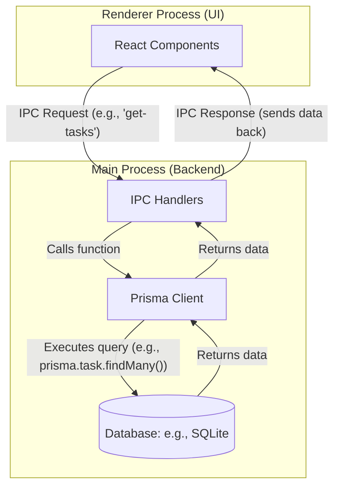

# Detailed Guide: Implementing Prisma in an Electron Application

This document provides a detailed, step-by-step guide for integrating Prisma with an Electron application to create a robust, persistent database layer.

## Core Architecture

The fundamental principle of using Prisma in Electron is that Prisma's query engine, which communicates with the database, runs in a Node.js environment. Therefore, all database interactions **must** be confined to Electron's **main process**. The renderer process, which handles the UI (e.g., React, Vue, etc.), runs in a browser-like environment and does not have the necessary privileges or Node.js APIs to run Prisma directly.

To bridge this gap, we use Electron's **Inter-Process Communication (IPC)** mechanism. The renderer process sends messages to the main process to request data, and the main process responds with the results.



---

## Implementation Steps

### 1. Installation

First, we need to install the necessary packages.

-   **`prisma`**: The Prisma command-line interface (CLI) tool. It's used for initializing Prisma, managing your schema, and running migrations. It is only needed during development, so we install it as a `devDependency`.
-   **`@prisma/client`**: The auto-generated and type-safe query builder. This is what you use in your code to interact with the database. It is needed in your production application, so it's a regular `dependency`.

```bash
# Install Prisma CLI as a development dependency
npm install --save-dev prisma

# Install Prisma Client as a regular dependency
npm install @prisma/client
```

### 2. Prisma Initialization

Next, initialize Prisma in your project. This command sets up the necessary configuration files.

```bash
npx prisma init --datasource-provider sqlite
```

This command does two things:
-   Creates a `prisma` directory.
-   Inside this directory, it creates a `schema.prisma` file. This file contains the configuration for your database connection and the schema for your data models.

### 3. Schema Definition

The `schema.prisma` file is the single source of truth for your database schema. Here, you define your data models using the Prisma Schema Language.

**Example: `prisma/schema.prisma`**
```prisma
generator client {
  provider = "prisma-client-js"
}

datasource db {
  provider = "sqlite"
  url      = "file:./dev.db" // Path to your SQLite database file
}

model Task {
  id          Int       @id @default(autoincrement())
  title       String
  status      String    @default("backlog")
  completed   Boolean   @default(false)
  createdAt   DateTime  @default(now())
  updatedAt   DateTime  @updatedAt
  subtasks    Subtask[]
  taskGroupId Int?
  taskGroup   TaskGroup? @relation(fields: [taskGroupId], references: [id])
}

```

### 4. Database Migration

A migration is a set of instructions that describes how to get from one state of your database schema to another. After defining your models, you need to create and apply a migration to create the database file and the corresponding tables.

```bash
npx prisma migrate dev --name init
```
This command will:
1.  Create the SQLite database file (e.g., `prisma/dev.db`).
2.  Create the tables (`Task`, `Subtask`, `TaskGroup`) based on your schema.
3.  Generate the Prisma Client based on your models, placing it in `node_modules/@prisma/client`.

### 5. Database Module (Main Process)

To keep the code organized, create a dedicated module in the main process to handle all database queries.

**Example: `src/main/db.js`**
```javascript
import { PrismaClient } from '@prisma/client'

const prisma = new PrismaClient()

export const getTasks = async () => {
  return await prisma.task.findMany({
    include: {
      subtasks: true,
      taskGroup: true
    }
  })
}

export const createTask = async (task) => {
  return await prisma.task.create({
    data: task
  })
}

// ... other functions for update and delete
```

### 6. IPC Handlers (Main Process)

Now, expose the database functions to the renderer process using IPC handlers in your main Electron file.

**Example: `src/main/index.js`**
```javascript
import { app, BrowserWindow, ipcMain } from 'electron'
import { getTasks, createTask } from './db' // Import your DB functions

// ... other Electron setup code

// IPC handlers for the database
ipcMain.handle('get-tasks', async () => {
  return await getTasks()
})

ipcMain.handle('create-task', async (event, task) => {
  return await createTask(task)
})

// ... other handlers
```

### 7. Preload Script (IPC Bridge)

The preload script acts as a secure bridge between the main and renderer processes. Use `contextBridge` to expose the IPC channels to the `window` object in the renderer process.

**Example: `src/preload/index.js`**
```javascript
import { contextBridge, ipcRenderer } from 'electron'

const api = {
  db: {
    getTasks: () => ipcRenderer.invoke('get-tasks'),
    createTask: (task) => ipcRenderer.invoke('create-task', task),
    // ... other functions
  }
}

contextBridge.exposeInMainWorld('api', api)
```

### 8. Frontend Integration (Renderer Process)

Finally, in your frontend components, you can now access the database functions through the `window.api` object.

**Example: A React Component (`App.jsx`)**
```jsx
import React, { useState, useEffect } from 'react'

function App() {
  const [tasks, setTasks] = useState([])

  useEffect(() => {
    const fetchTasks = async () => {
      // Check if the API is available before calling it
      if (window.api) {
        const result = await window.api.db.getTasks()
        setTasks(result)
      }
    }
    fetchTasks()
  }, [])

  const handleAddTask = async () => {
    if (window.api) {
      const newTask = { title: 'A new task from the UI' }
      const createdTask = await window.api.db.createTask(newTask)
      setTasks([...tasks, createdTask])
    }
  }

  return (
    <div>
      <h1>Tasks</h1>
      <button onClick={handleAddTask}>Add Task</button>
      <ul>
        {tasks.map(task => (
          <li key={task.id}>{task.title}</li>
        ))}
      </ul>
    </div>
  )
}

export default App
```

By following this architecture, you can effectively leverage the power of Prisma to build robust, data-driven Electron applications while maintaining a clean separation of concerns between the UI and the data layer.